# 


[](https://pypi.org/project/phiflow/)
[](https://pypi.org/project/phiflow/)
[](https://codecov.io/gh/tum-pbs/PhiFlow/branch/develop/)
[](https://colab.research.google.com/github/tum-pbs/PhiFlow/blob/develop/docs/Fluids_Tutorial.ipynb)


Φ<sub>Flow</sub> is an open-source simulation toolkit built for optimization and machine learning applications.
It is written mostly in Python and can be used with
[NumPy](https://numpy.org/),
[PyTorch](https://pytorch.org/),
[Jax](https://github.com/google/jax)
or [TensorFlow](https://www.tensorflow.org/).
The close integration with these machine learning frameworks allows it to leverage their automatic differentiation functionality,
making it easy to build end-to-end differentiable functions involving both learning models and physics simulations.


## Examples

### Grids

<table>
    <tbody>
        <tr>
            <td style="width: 25%;"><a href="https://tum-pbs.github.io/PhiFlow/examples/grids/Fluid_Logo.html"></a></td>
            <td style="width: 25%;"><a href="https://tum-pbs.github.io/PhiFlow/examples/grids/Wake_Flow.html">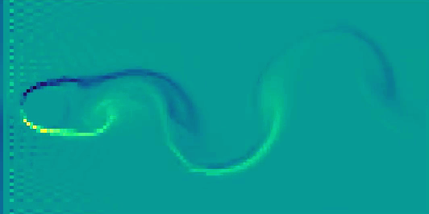</a></td>
            <td style="width: 25%;"><a href="https://tum-pbs.github.io/PhiFlow/examples/grids/Lid_Driven_Cavity.html"></a></td>
            <td style="width: 25%;"><a href="https://tum-pbs.github.io/PhiFlow/examples/grids/Taylor_Green.html">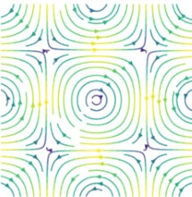</a></td>
        </tr>
        <tr>
            <td align="center">Fluid logo</td>
            <td align="center">Wake flow</td>
            <td align="center">Lid-driven cavity</td>
            <td align="center">Taylor-Green</td>
        </tr>
        <tr>
            <td style="width: 25%;"><a href="https://tum-pbs.github.io/PhiFlow/examples/grids/Smoke_Plume.html"></a></td>
            <td style="width: 25%;"><a href="https://tum-pbs.github.io/PhiFlow/examples/grids/Variable_Boundaries.html"></a></td>
            <td style="width: 25%;"><a href="https://tum-pbs.github.io/PhiFlow/examples/grids/Batched_Smoke.html">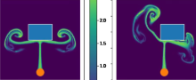</a></td>
            <td style="width: 25%;"><a href="https://tum-pbs.github.io/PhiFlow/examples/grids/Moving_Obstacles.html"></a></td>
        </tr>
        <tr>
            <td align="center">Smoke plume</td>
            <td align="center">Variable boundaries</td>
            <td align="center">Parallel simulations</td>
            <td align="center">Moving obstacles</td>
        </tr>
        <tr>
            <td style="width: 25%;"><a href="https://tum-pbs.github.io/PhiFlow/examples/grids/Rotating_Bar.html">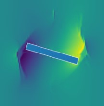</a></td>
            <td style="width: 25%;"><a href="https://tum-pbs.github.io/PhiFlow/examples/grids/Multi_Grid_Fluid.html">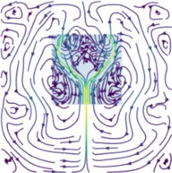</a></td>
            <td style="width: 25%;"><a href="https://tum-pbs.github.io/PhiFlow/examples/grids/Higher_order_Kolmogorov.html">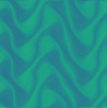</a></td>
            <td style="width: 25%;"><a href="https://tum-pbs.github.io/PhiFlow/examples/grids/Heat_Flow.html">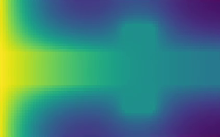</a></td>
        </tr>
        <tr>
            <td align="center">Rotating bar</td>
            <td align="center">Multi-grid fluid</td>
            <td align="center">Higher-order Kolmogorov</td>
            <td align="center">Heat flow</td>
        </tr>
        <tr>
            <td style="width: 25%;"><a href="https://tum-pbs.github.io/PhiFlow/examples/grids/Burgers.html">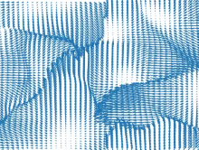</a></td>
            <td style="width: 25%;"><a href="https://tum-pbs.github.io/PhiFlow/examples/grids/Reaction_Diffusion.html">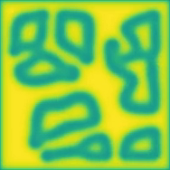</a></td>
            <td style="width: 25%;"><a href="https://tum-pbs.github.io/PhiFlow/examples/grids/Waves.html">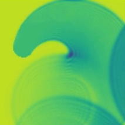</a></td>
            <td style="width: 25%;"><a href="https://tum-pbs.github.io/PhiFlow/examples/grids/Julia_Set.html">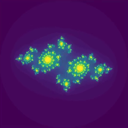</a></td>
        </tr>
        <tr>
            <td align="center">Burgers' equation</td>
            <td align="center">Reaction-diffusion</td>
            <td align="center">Waves</td>
            <td align="center">Julia Set</td>
        </tr>
    </tbody>
</table>

### Mesh

<table>
    <tbody>
        <tr>
            <td style="width: 25%;"><a href="https://tum-pbs.github.io/PhiFlow/examples/mesh/FVM_BackStep.html">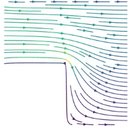</a></td>
            <td style="width: 25%;"><a href="https://tum-pbs.github.io/PhiFlow/examples/mesh/FVM_Heat.html">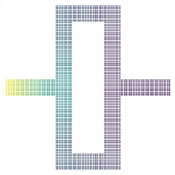</a></td>
            <td style="width: 25%;"><a href="https://tum-pbs.github.io/PhiFlow/examples/mesh/Build_Mesh.html">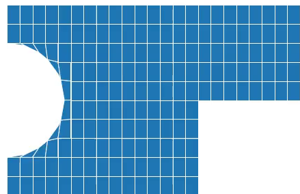</a></td>
            <td style="width: 25%;"><a href="https://tum-pbs.github.io/PhiFlow/examples/mesh/FVM_Cylinder_GMsh.html">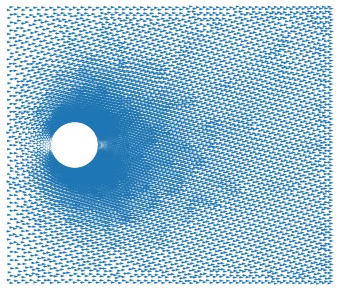</a></td>
        </tr>
        <tr>
            <td align="center">Backward facing step</td>
            <td align="center">Heat flow</td>
            <td align="center">Mesh construction</td>
            <td align="center">Wake flow</td>
        </tr>
    </tbody>
</table>


### Particles

<table>
    <tbody>
        <tr>
            <td style="width: 25%;"><a href="https://tum-pbs.github.io/PhiFlow/examples/particles/SPH.html"></a></td>
            <td style="width: 25%;"><a href="https://tum-pbs.github.io/PhiFlow/examples/particles/FLIP.html">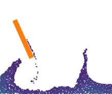</a></td>
            <td style="width: 25%;"><a href="https://tum-pbs.github.io/PhiFlow/examples/particles/Streamlines.html">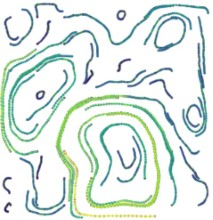</a></td>
            <td style="width: 25%;"><a href="https://tum-pbs.github.io/PhiFlow/examples/particles/Terrain.html"></a></td>
        </tr>
        <tr>
            <td align="center">SPH</td>
            <td align="center">FLIP</td>
            <td align="center">Streamlines</td>
            <td align="center">Terrain</td>
        </tr>
        <tr>
            <td style="width: 25%;"><a href="https://tum-pbs.github.io/PhiFlow/examples/particles/Gravity.html"></a></td>
            <td style="width: 25%;"><a href="https://tum-pbs.github.io/PhiFlow/examples/particles/Billiards.html"></a></td>
            <td style="width: 25%;"><a href="https://tum-pbs.github.io/PhiFlow/examples/particles/Ropes.html">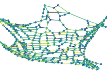</a></td>
        </tr>
        <tr>
            <td align="center">Gravity</td>
            <td align="center">Billiards</td>
            <td align="center">Ropes</td>
        </tr>
    </tbody>
</table>

### Optimization & Networks

<table>
    <tbody>
        <tr>
            <td style="width: 25%;"><a href="https://tum-pbs.github.io/PhiFlow/examples/optim/Gradient_Descent.html"></a></td>
            <td style="width: 25%;"><a href="https://tum-pbs.github.io/PhiFlow/examples/optim/Optimize_Throw.html"></a></td>
            <td style="width: 25%;"><a href="https://tum-pbs.github.io/PhiFlow/examples/optim/Learn_Throw.html">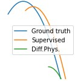</a></td>
            <td style="width: 25%;"><a href="https://tum-pbs.github.io/PhiFlow/examples/optim/PIV.html">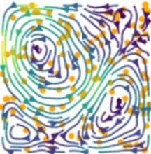</a></td>
        </tr>
        <tr>
            <td align="center">Gradient Descent</td>
            <td align="center">Optimize throw</td>
            <td align="center">Learning to throw</td>
            <td align="center">PIV</td>
        </tr>
        <tr>
            <td style="width: 25%;"><a href="https://tum-pbs.github.io/PhiFlow/examples/optim/Close_Packing.html"></a></td>
            <td style="width: 25%;"><a href="https://tum-pbs.github.io/PhiFlow/examples/optim/Learn_Potential.html"></a></td>
            <td style="width: 25%;"><a href="https://tum-pbs.github.io/PhiFlow/examples/optim/Differentiable_Pressure.html">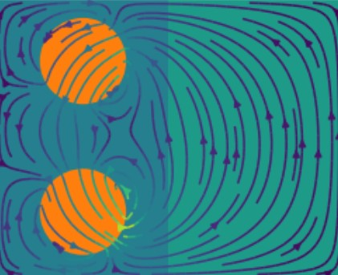</a></td>
        </tr>
        <tr>
            <td align="center">Close packing</td>
            <td align="center">Learning Φ(x,y)</td>
            <td align="center">Differentiable pressure</td>
        </tr>
    </tbody>
</table>


## Installation

Installation with [pip](https://pypi.org/project/pip/) on [Python 3.6](https://www.python.org/downloads/) and above:
``` bash
$ pip install phiflow
```
Install [PyTorch](https://pytorch.org/), [TensorFlow](https://www.tensorflow.org/install) or [Jax](https://github.com/google/jax#installation) in addition to Φ<sub>Flow</sub> to enable machine learning capabilities and GPU execution.
To enable the web UI, also install [Dash](https://pypi.org/project/dash/).
For optimal GPU performance, you may compile the custom CUDA operators, see the [detailed installation instructions](https://tum-pbs.github.io/PhiFlow/Installation_Instructions.html).

You can verify your installation by running
```bash
$ python3 -c "import phi; phi.verify()"
```
This will check for compatible PyTorch, Jax and TensorFlow installations as well.


## Features

* Tight integration with PyTorch, Jax and TensorFlow for straightforward neural network training with fully differentiable simulations that can [run on the GPU](https://tum-pbs.github.io/PhiFlow/GPU_Execution.html#enabling-gpu-execution).
* Built-in PDE operations with focus on fluid phenomena, allowing for concise formulation of simulations.
* Flexible, easy-to-use [web interface](https://tum-pbs.github.io/PhiFlow/Web_Interface.html) featuring live visualizations and interactive controls that can affect simulations or network training on the fly.
* Object-oriented, vectorized design for expressive code, ease of use, flexibility and extensibility.
* Reusable simulation code, independent of backend and dimensionality, i.e. the exact same code can run a 2D fluid sim using NumPy and a 3D fluid sim on the GPU using TensorFlow or PyTorch.
* High-level linear equation solver with automated sparse matrix generation.


## 📖 Documentation and Tutorials
[**Documentation Overview**](https://tum-pbs.github.io/PhiFlow/)
&nbsp; • &nbsp; [**▶ YouTube Tutorials**](https://www.youtube.com/playlist?list=PLYLhRkuWBmZ5R6hYzusA2JBIUPFEE755O)
&nbsp; • &nbsp; [**API**](https://tum-pbs.github.io/PhiFlow/phi/)
&nbsp; • &nbsp; [**Demos**](https://github.com/tum-pbs/PhiFlow/tree/master/demos)
&nbsp; • &nbsp; [ **Playground**](https://colab.research.google.com/drive/1zBlQbmNguRt-Vt332YvdTqlV4DBcus2S#offline=true&sandboxMode=true)

Φ-Flow builds on the tensor functionality from [Φ<sub>ML</sub>](https://github.com/tum-pbs/PhiML).
To understand how Φ<sub>Flow</sub> works, check [named and typed dimensions](https://tum-pbs.github.io/PhiML/Introduction.html) first.

### Getting started

* [Installation instructions](https://tum-pbs.github.io/PhiFlow/Installation_Instructions.html)
* [](https://colab.research.google.com/github/tum-pbs/PhiFlow/blob/develop/docs/Math_Introduction.ipynb) [Tensors](https://tum-pbs.github.io/PhiFlow/Math_Introduction.html)
* [](https://colab.research.google.com/github/tum-pbs/PhiFlow/blob/develop/docs/Fluids_Tutorial.ipynb) [Fluids](https://tum-pbs.github.io/PhiFlow/Fluids_Tutorial.html)
* [](https://colab.research.google.com/github/tum-pbs/PhiFlow/blob/develop/docs/Cookbook.ipynb) [Cookbook](https://tum-pbs.github.io/PhiFlow/Cookbook.html)

### Physics

* [Grid-based fluids](https://tum-pbs.github.io/PhiFlow/Fluid_Simulation.html)
* [Higher-order schemes](https://tum-pbs.github.io/PhiFlow/Taylor_Green_Comparison.html)

### Fields

* [Overview](https://tum-pbs.github.io/PhiFlow/Fields.html)
* [Staggered grids](https://tum-pbs.github.io/PhiFlow/Staggered_Grids.html)
* [I/O](https://tum-pbs.github.io/PhiFlow/Reading_and_Writing_Data.html) & [scene format](https://tum-pbs.github.io/PhiFlow/Scene_Format_Specification.html)

### Geometry

* [Overview](https://tum-pbs.github.io/PhiFlow/Geometry.html)
* [Signed distance fields](https://tum-pbs.github.io/PhiFlow/SDF.html)
* [Heightmaps](https://tum-pbs.github.io/PhiFlow/Heightmaps.html)

### Tensors

* [▶️ Introduction Video](https://youtu.be/4nYwL8ZZDK8)
* [Introduction Notebook](Math_Introduction.html)
* [GPU execution](https://tum-pbs.github.io/PhiFlow/GPU_Execution.html#enabling-gpu-execution)

### Other

* [Φ<sub>Flow</sub> to Blender](https://github.com/intergalactic-mammoth/phiflow2blender) 
* [What to Avoid](https://tum-pbs.github.io/PhiFlow/Known_Issues.html): How to keep your code compatible with PyTorch, TensorFlow and Jax
* [Legacy visualization](https://tum-pbs.github.io/PhiFlow/Visualization.html) & [Dash](https://tum-pbs.github.io/PhiFlow/Web_Interface.html) & [Console](https://tum-pbs.github.io/PhiFlow/ConsoleUI.html)
* [Legacy physics overview](https://tum-pbs.github.io/PhiFlow/Physics.html)


## 📄 Citation

Please use the following citation:

```
@inproceedings{holl2024phiflow,
  title={${\Phi}_{\text{Flow}}$ ({PhiFlow}): Differentiable Simulations for PyTorch, TensorFlow and Jax},
  author={Holl, Philipp and Thuerey, Nils},
  booktitle={International Conference on Machine Learning},
  year={2024},
  organization={PMLR}
}
```

## Publications

We will upload a whitepaper, soon.
In the meantime, please cite the ICLR 2020 paper.

* [Learning to Control PDEs with Differentiable Physics](https://ge.in.tum.de/publications/2020-iclr-holl/), *Philipp Holl, Vladlen Koltun, Nils Thuerey*, ICLR 2020.
* [Solver-in-the-Loop: Learning from Differentiable Physics to Interact with Iterative PDE-Solvers](https://arxiv.org/abs/2007.00016), *Kiwon Um, Raymond Fei, Philipp Holl, Robert Brand, Nils Thuerey*, NeurIPS 2020.
* [Φ<sub>Flow</sub>: A Differentiable PDE Solving Framework for Deep Learning via Physical Simulations](https://montrealrobotics.ca/diffcvgp/), *Nils Thuerey, Kiwon Um, Philipp Holl*, DiffCVGP workshop at NeurIPS 2020.
* [Physics-based Deep Learning](https://physicsbaseddeeplearning.org/intro.html) (book), *Nils Thuerey, Philipp Holl, Maximilian Mueller, Patrick Schnell, Felix Trost, Kiwon Um*, DiffCVGP workshop at NeurIPS 2020.
* [Half-Inverse Gradients for Physical Deep Learning](https://arxiv.org/abs/2203.10131), *Patrick Schnell, Philipp Holl, Nils Thuerey*, ICLR 2022.
* [Scale-invariant Learning by Physics Inversion](https://arxiv.org/abs/2109.15048), *Philipp Holl, Vladlen Koltun, Nils Thuerey*, NeurIPS 2022.


## Benchmarks & Data Sets

Φ<sub>Flow</sub> has been used in the creation of various public data sets, such as
[PDEBench](https://github.com/pdebench/PDEBench) and [PDEarena](https://microsoft.github.io/pdearena/).

[See more packages that use Φ<sub>Flow</sub>](https://github.com/tum-pbs/PhiFlow/network/dependents)

## 🕒 Version History

The [Version history](https://github.com/tum-pbs/PhiFlow/releases) lists all major changes since release.
The releases are also listed on [PyPI](https://pypi.org/project/phiflow/).

## 👥 Contributions

Contributions are welcome! Check out [this document](CONTRIBUTING.md) for guidelines.

## Acknowledgements

This work is supported by the ERC Starting Grant realFlow (StG-2015-637014) and the Intel Intelligent Systems Lab.
