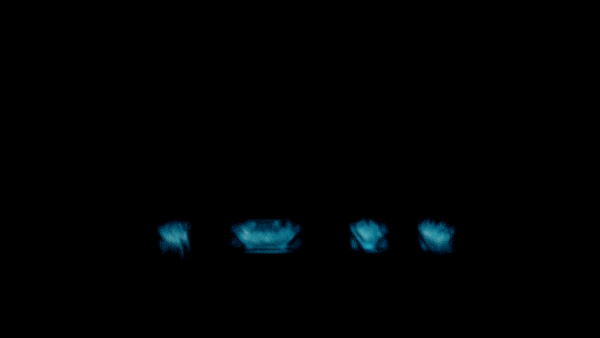
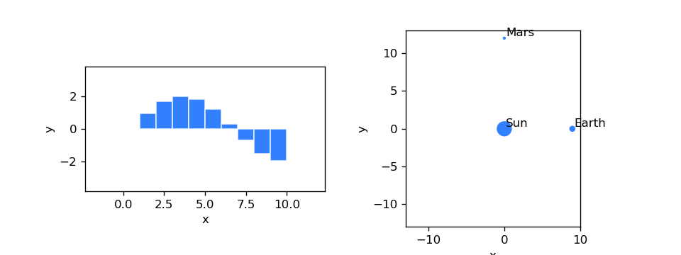

# 


[](https://pypi.org/project/phiflow/)
[](https://pypi.org/project/phiflow/)
[](https://codecov.io/gh/tum-pbs/PhiFlow/branch/develop/)
[](https://colab.research.google.com/github/tum-pbs/PhiFlow/blob/develop/docs/Fluids_Tutorial.ipynb)

Φ<sub>Flow</sub> is an open-source simulation toolkit built for optimization and machine learning applications.
It is written mostly in Python and can be used with
[NumPy](https://numpy.org/),
[PyTorch](https://pytorch.org/),
[Jax](https://github.com/google/jax)
or [TensorFlow](https://www.tensorflow.org/).
The close integration with these machine learning frameworks allows it to leverage their automatic differentiation functionality,
making it easy to build end-to-end differentiable functions involving both learning models and physics simulations.

[//]: # (![Gui]&#40;https://tum-pbs.github.io/PhiFlow/figures/WebInterface.png&#41;)

|   |                                                                                                                                                                                                                                                                        |
|------------------|---------------------------------------------------------------------------------------------------------------------------------------------------------------------------------------------------------------------------------------------------------------------------------------------------------------|
| [Fluids Tutorial](https://tum-pbs.github.io/PhiFlow/Fluids_Tutorial.html) &nbsp; • &nbsp; [Φ<sub>Flow</sub> to Blender](https://github.com/intergalactic-mammoth/phiflow2blender) | [Animation Gallery](https://tum-pbs.github.io/PhiFlow/Animations.html) &nbsp; • &nbsp; [Solar System](https://tum-pbs.github.io/PhiFlow/Planets_Tutorial.html) &nbsp; • &nbsp; [Learning to Throw](https://tum-pbs.github.io/PhiFlow/Learn_to_Throw_Tutorial.html) |


## Features

* Variety of built-in PDE operations with focus on fluid phenomena, allowing for concise formulation of simulations.
* Tight integration with PyTorch, Jax and TensorFlow for straightforward neural network training with fully differentiable simulations that can [run on the GPU](https://tum-pbs.github.io/PhiFlow/GPU_Execution.html#enabling-gpu-execution).
* Flexible, easy-to-use [web interface](https://tum-pbs.github.io/PhiFlow/Web_Interface.html) featuring live visualizations and interactive controls that can affect simulations or network training on the fly.
* Object-oriented, vectorized design for expressive code, ease of use, flexibility and extensibility.
* Reusable simulation code, independent of backend and dimensionality, i.e. the exact same code can run a 2D fluid sim using NumPy and a 3D fluid sim on the GPU using TensorFlow or PyTorch.
* High-level linear equation solver with automated sparse matrix generation.


## Installation

Installation with [pip](https://pypi.org/project/pip/) on [Python 3.6](https://www.python.org/downloads/) and above:
``` bash
$ pip install phiflow dash
```
Install PyTorch, TensorFlow or Jax in addition to Φ<sub>Flow</sub> to enable machine learning capabilities and GPU execution.
See the [detailed installation instructions](https://tum-pbs.github.io/PhiFlow/Installation_Instructions.html) on how to compile the custom CUDA operators and verify your installation.

## Documentation and Tutorials
[**Documentation Overview**](https://tum-pbs.github.io/PhiFlow/)
&nbsp; • &nbsp; [**▶ YouTube Tutorials**](https://www.youtube.com/playlist?list=PLYLhRkuWBmZ5R6hYzusA2JBIUPFEE755O)
&nbsp; • &nbsp; [**API**](https://tum-pbs.github.io/PhiFlow/phi/)
&nbsp; • &nbsp; [**Demos**](https://github.com/tum-pbs/PhiFlow/tree/develop/demos)
&nbsp; • &nbsp; [ **Playground**](https://colab.research.google.com/drive/1zBlQbmNguRt-Vt332YvdTqlV4DBcus2S#offline=true&sandboxMode=true)

To get started, check out our YouTube tutorial series and the following Jupyter notebooks:

* [ Fluids](https://colab.research.google.com/github/tum-pbs/PhiFlow/blob/develop/docs/Fluids_Tutorial.ipynb): Introduction to core classes and fluid-related functions.
* [ Solar System](https://colab.research.google.com/github/tum-pbs/PhiFlow/blob/develop/docs/Planets_Tutorial.ipynb): Visualize a many-body system with Newtonian gravity.
* [ Learning to Throw](https://colab.research.google.com/github/tum-pbs/PhiFlow/blob/develop/docs/Learn_to_Throw_Tutorial.ipynb): Train a neural network to hit a target, comparing supervised and differentiable physics losses.

If you like to work with an IDE, like PyCharm or VS Code, the following demos will also be helpful:

* [smoke_plume.py](demos/smoke_plume.py) runs a smoke simulation and displays it in the web interface.
* [optimize_pressure.py](demos/differentiate_pressure.py) uses TensorFlow to optimize a velocity field and displays it in the web interface.

## Publications

We have recently submitted a whitepaper.
In the meantime, please cite the ICLR 2020 paper.

* [Learning to Control PDEs with Differentiable Physics](https://ge.in.tum.de/publications/2020-iclr-holl/), *Philipp Holl, Vladlen Koltun, Nils Thuerey*, ICLR 2020.
* [Solver-in-the-Loop: Learning from Differentiable Physics to Interact with Iterative PDE-Solvers](https://arxiv.org/abs/2007.00016), *Kiwon Um, Raymond Fei, Philipp Holl, Robert Brand, Nils Thuerey*, NeurIPS 2020.
* [Φ<sub>Flow</sub>: A Differentiable PDE Solving Framework for Deep Learning via Physical Simulations](https://montrealrobotics.ca/diffcvgp/), *Nils Thuerey, Kiwon Um, Philipp Holl*, DiffCVGP workshop at NeurIPS 2020.
* [Half-Inverse Gradients for Physical Deep Learning](https://arxiv.org/abs/2203.10131), *Patrick Schnell, Philipp Holl, Nils Thuerey*, ICLR 2022.

## Version History

The [Version history](https://github.com/tum-pbs/PhiFlow/releases) lists all major changes since release.
The releases are also listed on [PyPI](https://pypi.org/project/phiflow/).

## Contributions

Contributions are welcome! Check out [this document](CONTRIBUTING.md) for guidelines.

## Acknowledgements

This work is supported by the ERC Starting Grant realFlow (StG-2015-637014) and the Intel Intelligent Systems Lab.
