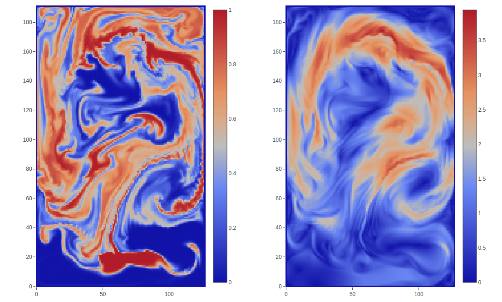

# Φ<sub>*Flow*</sub>

[](https://gitlab.lrz.de/ga67fet/phiflow/commits/master)




Φ<sub>*Flow*</sub> is a research-oriented, open-source fluid simulation toolkit.
It is written mostly in Python and can use both NumPy and TensorFlow for execution.

Having all functionality of a fluid simulation running in TensorFlow opens up the possibility of back-propagating gradients through the simulation as well as running the simulation on GPUs.


## Features
- Tight integration with [TensorFlow](https://www.tensorflow.org/) making network training easy
- All simulation steps are differentiable
- Fluid simulations can be run completely on the GPU
- Easy visualization of live data in the browser with a powerful interactive GUI
- Tweaking of network hyperparameters during training through the GUI
- Native support for n-dimensional fluid simulations
- Weak dependency on TensorFlow, allowing for execution of simulations with NumPy and SciPy
- Option of application deployment as Flask web-service


## Installation

The following commands will get you Φ<sub>*Flow*</sub> + browser-GUI + NumPy execution:

```
$ git clone https://gitlab.lrz.de/ga67fet/phiflow.git
$ pip install phiflow/[gui]
```

See the [detailed installation instructions](documentation/install.md) on how to install Φ<sub>*Flow*</sub>
with TensorFlow support.


## Documentation and Guides

If you would like to get right into it and have a look at some example code, check out the following files in the `apps` directory:

- [simpleplume.py](./apps/simpleplume.py): Runs a smoke simulation and displays it in the browser
- [optimize_pressure.py](./apps/optimize_pressure.py): Uses TensorFlow to optimize a velocity channel. TensorBoard can be started from the GUI and displays the loss.

The [simulation overview](documentation/sim.md) explains how to run predefined simulations using either the NumPy or TensorFlow backend. It also introduces the GUI.

The [simulation code design documentation](documentation/simdesign.md) provides a deeper look into the object-oriented code design of simulations.

To learn how specific simulations are implemented, check out the documentation for [Smoke](documentation/smoke.md). 

[Writing a Φ<sub>*Flow*</sub> Application](documentation/gui.md) introduces the high-level classes and expalins how to use the Φ<sub>*Flow*</sub> GUI for displaying a simulation.

For training machine learning models, [this document](documentation/tfmodel.md) gives an introduction int o writing a GUI-enabled application.


For I/O and data management, see the [data documentation](documentation/data.md).


## Directory structure

The directory structure is as follows:

- [apps](apps) contains python executables that use Φ<sub>*Flow*</sub> and display the simulation using the GUI.
- [documentation](documentation) further information and guides.
- [phi](phi) and subpackages contain the core Φ<sub>*Flow*</sub> library.
- [tests](tests) contains tests of Φ<sub>*Flow*</sub> that mostly run without the GUI.


## Known Issues

GUI: Message not updating correctly on some Chrome installations on Windows.

TensorBoard: Live supervision does not work when running a local app that writes to a remote directory.