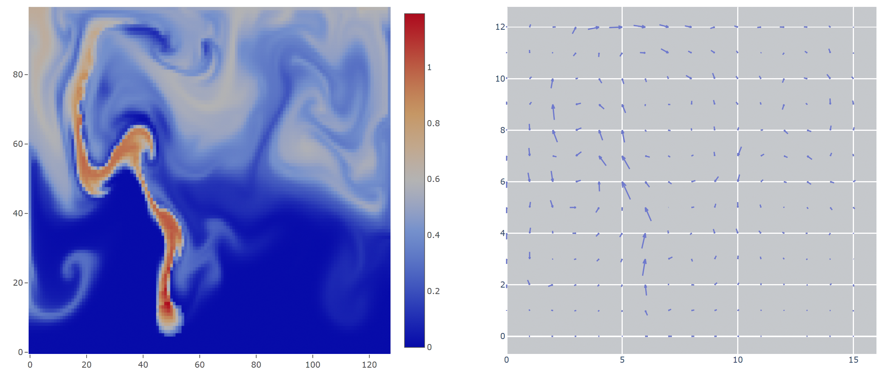

# ΦFlow Web Interface

ΦFlow provides an interactive web interface that can display 1D, 2D and 3D data.
This GUI uses [Dash](https://plotly.com/dash/) to host a website on a local port.
Opening the website remotely may require port forwarding, e.g. via SSH.

The Dash GUI is the default user interface for python modules, i.e. when running a `.py` file as the main module.
It can be specifically selected by setting `gui='dash'` in [`view()`](phi/vis/index.html#phi.vis.view) or [`show()`](phi/vis/index.html#phi.vis.show).

## Tabs & Features

The web interface consists of multiple tabs (web pages) which can be accessed at the upper left corner of each page.

- **Home** shows the title and description of the app. It allows the user to choose one field to view and to start/pause the app or step a single frame. Additionally all app-specific controls are shown at the bottom.
- **Side-by-Side** is similar to Home but shows two fields at a time instead of one.
- **Info** displays additional information about the current session such as file paths and run time.
- **Log** displays the complete application log.
- **Φ Board** contains benchmarking functionality. For TensorFlow apps it also allows the user to launch TensorBoard and run the TensorFlow profiler.
- **Help** refers to this page.

Tips & Tricks:

- You can run a specified number of frames by entering the number in the text box next to the 'Step' button. If you put a '*' before the number, it is multiplied by the app's `stride` value which can be found in the `info` tab.

## Frame Rate and Refresh Rate

The web interface provides a *Refresh rate* control above the field viewer.
This value describes how often the diagrams in the browser are updated.
It is independent of the framerate specified in `view()` which defines how quickly the user code is executed.

## Configuration

The `show` method supports additional keyword arguments to configure how the App contents are displayed.

The `display` parameter defines which fields are displayed initially, e.g. `display='Density'` or `display=('Density', 'Velocity')`.

### Further configuration parameters

| Parameter            | Description                                                                                       | Default |
|----------------------|---------------------------------------------------------------------------------------------------|---------|
| external_web_server  | Whether an external tool is used to host the Dash server. If False, launches a new web server.    | False   |
| arrow_origin         | Which part of the arrow is centered at the position of the field. One of 'base', 'center', 'tip'. | 'tip'   |
| max_arrow_resolution | Downscale grids to have no more than resolution**2 cells before drawing arrows.                   | 40      |
| min_arrow_length     | Fraction of figure size. Smaller arrows are not drawn.                                            | 0.005   |
| max_arrows           | Maximum number of arrows to draw. Arrows are sorted by length.                                    | 2000    |
| draw_full_arrows     | Whether to draw the tips of arrows. If False, draws arrows as lines.                              | False   |
| colormap             | Built-in: 'viridisx', 'OrWhBl'. Additional colormaps can be used if matplotlib is installed.      | 'viridisx'|
| slow_colorbar        | If True, keeps colorbar similar to previous frame if possible.                                    | False   |
