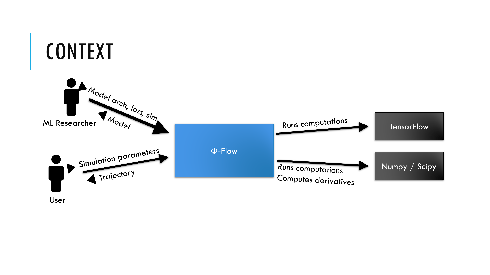
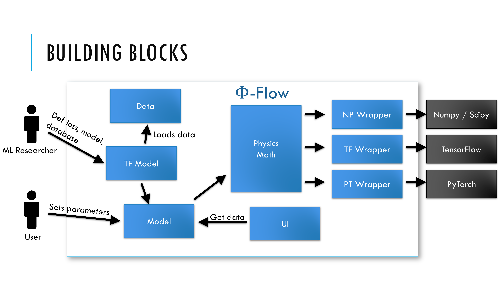
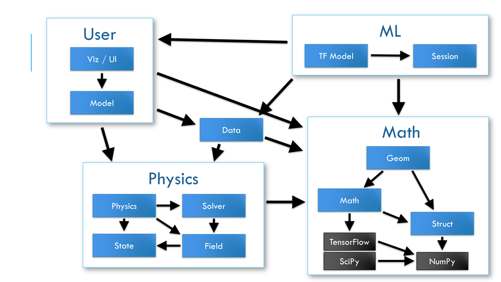

# # Φ*Flow* Architecture

## Context

|    Actor / System    |    Description                                                                                  |
|----------------------|-------------------------------------------------------------------------------------------------|
|    ML Researcher     |    Scientist interested in training   ML models, publishing results                             |
|    User              |    Person who wants to run built-in   simulations and store / analyse the results               |
|    NumPy             |    Non-differentiable Python   computing library                                                |
|    TensorFlow, PyTorch        |    Machine-learning frameworks supporting GPU computation and reverse-mode differentiation    |

## Building Blocks

|    Actor / System |    Description                                                                                        |
|-------------------|-------------------------------------------------------------------------------------------------------|
|    App            |    Allows setting up simulations and GUI                                                            |
|    LearningApp    |    Trains neural networks, creates logs, visualizes results with UI                                 |
|    Data           |    Writes and loads data from disc                                                                    |
|    UI             |    Hosts web server to display data of Model                                                        |
|    Physics        |    Defines simulation classes,   implements built-in simulations like Navier-Stokes,   Schrödinger    |

## Module dependencies

