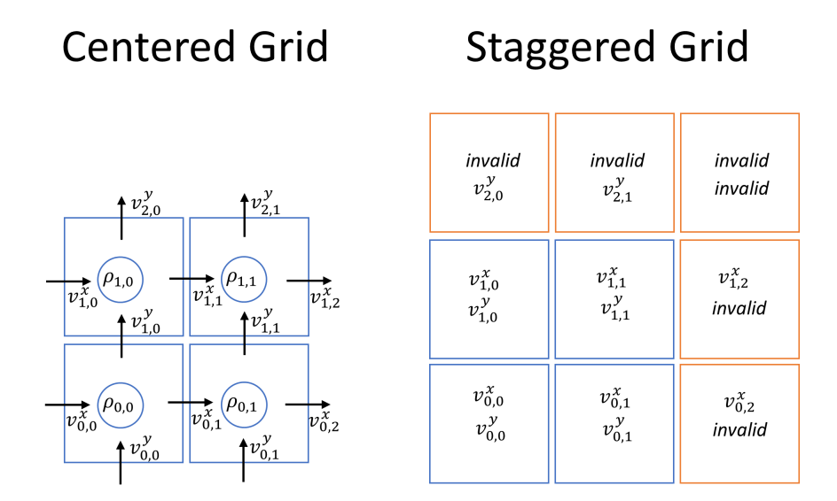

# Staggered grids

Staggered grids are a key component of the marker and cell (MAC) method. They sample the velocity components at the centers of the corresponding lower faces of grid cells. This makes them fundamentally different from regular arrays or tensors which are sampled at the cell centers. Staggered grids make it easy to compute the divergence of a velocity channel.



In Φ<sub>*Flow*</sub>, staggered grids are represented as instances of [StaggeredGrid](../phi/math/nd.py). They have one more entry in every spatial dimension than corresponding centered fields since the upper face of the upper most cell needs to be included as well.

Staggered grids can be created from the [FluidSimulation](../phi/flow/flow.py) or [TFFluidSimulation](../phi/tf/flow.py) object.

```python
# Create a StaggeredGrid
velocity = sim.placeholder("staggered")
velocity = sim.zeros("staggered")
```

They can also be created from centered fields.

```python
staggered_grad = StaggeredGrid.gradient(centered_field)
staggered_field_x = StaggeredGrid.from_scalar(centered_field, [0, 0, 1])
```

`StaggeredGrid`s can hold both TensorFlow tensors and NumPy `ndarray`s, depending on the simulation configuration. They support basic backend operations and can be passed to `TFSimulation.run()` like TensorFlow tensors.

Some useful operations include:

```python
advected_field = velocity.advect(field)
curl = velocity.curl()
divergence = velocity.divergence()
```

To get a tensor or ndarray object from a staggered grid, one of the following sampling methods can be used.

```python
velocity.staggered  # array containing staggered components
velocity.at_centers()  # Interpolated to cell centers
velocity.at_faces(axis)  # Interpolated to face centers of given axis index
```
